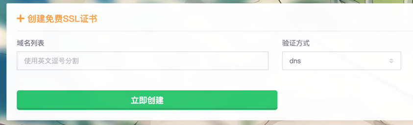
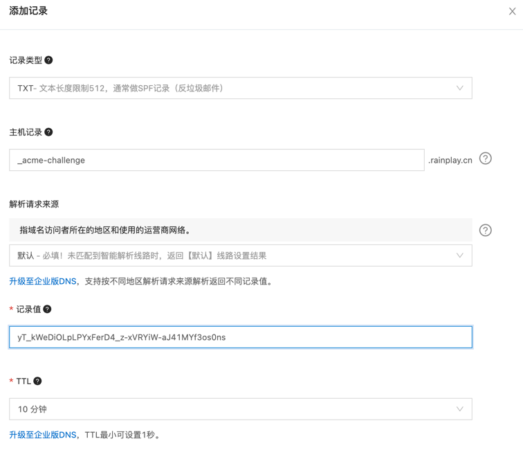
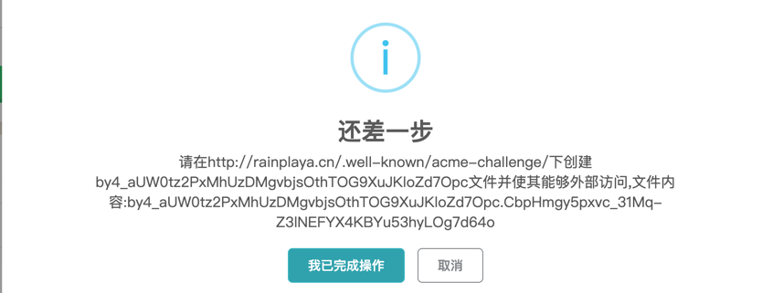
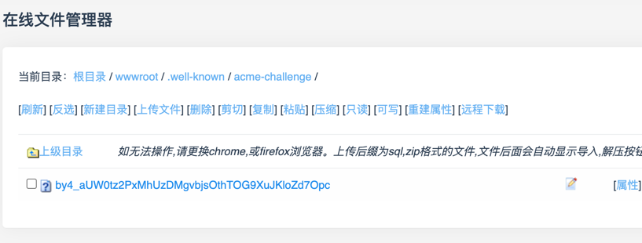
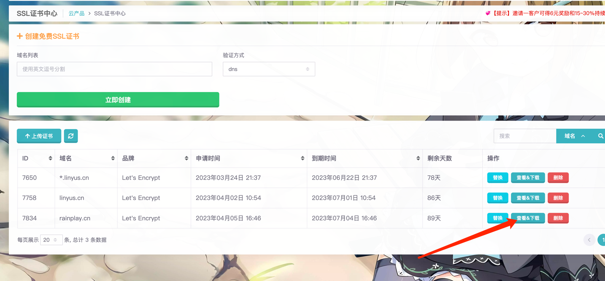
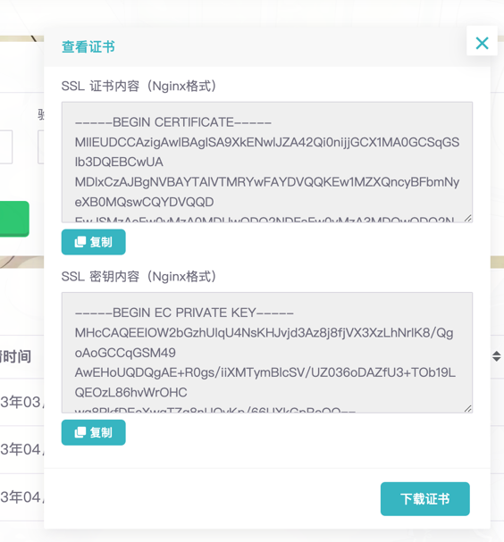

据悉，自从去年的雨云主站更新之后，虽然是界面焕新大改版，但是免费SSL证书的功能没有了，导致不少用户伤心。但是在最近的更新中，免费二级域名和SSL证书以全新的方式回归到雨云了！

免费SSL证书是为了提升雨云用户的网站安全性和用户体验而推出的新服务。下面就为大家详细介绍！ヾ(@^▽^@)ノ！

<!--truncate-->
## SSL证书有什么用
很简单，安全。

SSL证书是一种加密技术，它可以保护你的网站和用户之间的数据传输安全，防止被黑客或者第三方窃取或者篡改。有了SSL证书，你的网站就可以使用https协议，这样你的网站地址栏就会显示一个小锁🔒图标，表示你的网站是安全可信的。这不仅可以提高你的网站信誉和用户信任度，还可以提高你的网站排名和流量。

如果你的网站没有SSL证书，这意味着第三方攻击者可以查到你的访问内容。

例如，如果您正在咖啡厅坐着，您和攻击者都连接到了同一个热点，有一位攻击者正在监听您连接的网络。

此时，您打开一个http的网站，然后输入了您的账号密码。攻击者就可以通过抓包得到你的账号密码！😱

如果使用了https，这就是另一个情况，虽然攻击者还可以抓取到你的数据包，但是因为信息经过加密，他无法获取您正在和网站传输的内容，因此您的数据是安全的。

要给您的网站加上https，您需要申请一个SSL证书，市面上有的收费有的免费，贵到几千元一年，便宜到免费，您可以根据自己的需要选择不同的证书，但是对于大多数人，我们建议使用Let's Encrypt的免费的证书，支持通配符。

### 申请证书
有很多云提供商可以申请证书，例如阿里云、腾讯云等，这些提供商申请方法较为繁琐，而且需要审核。
国外的话，也还有zerossl.com，又有诸多限制，推荐您使用雨云（https://www.rainyun.cc）来申请证书，方便快捷，雨云是新一代的云服务提供商。

1. 先注册一个雨云账号（可以通过邀请链接注册：https://www.rainyun.cc/?ref=official ）这样会获得一张5元的优惠券，即使现在不用，以后也可以有优惠，比直接注册好。
2. 前往SSL证书中心（https://app.rainyun.cc/apps/ssl/list）  验证方式推荐DNS，您也可以选择HTTP方式，区别是前者要去DNS解析处添加解析，或者要在您的网站创建一个指定的文件和内容，如果您已经有HTTP的网站，可以选择后者。
3. 输入您的域名，如果要多个域名的话，可以用逗号分隔，如果您想给您网站所有的二级域名都加上证书保护，可以写：*.yourdomain.com，记得把yourdomain.com换成你自己的域名！😂
4. 接下来需要验证您的域名所有权，确认您是域名的主人，您可以点击立即创建，按您选择的验证方式不同，请参考以下步骤：
   1. DNS验证：
      1. 弹出的提示框会给您相应的信息，根据提示操作（图片内的仅供示例，请按您自己的提示来做）。
        
      2. 前往您的DNS解析商（您首先需要一个域名。。）添加一个解析，以下以阿里云为例，记得修改记录类型为TXT。
      
   2. HTTP验证：
      1. 提示框会提示您相应的文件名和文件内容（图片内的仅供示例，请按您自己的提示来做）。
         
      2. 前往您的网站根目录，按提示创建对应的文件，并确保访问如图所示的链接可以访问到您的文件。
      3. 以雨云EasyPanel虚拟主机为例，创建对应的文件，文件内容为如图所示的文件内容。
         
5. 当您完成操作，证书创建成功，将会自动上传到雨云的证书列表内，方便您在使用虚拟主机时一键选择，如果您想把证书用到其他地方，点击"查看&下载"键，就可以下载您的证书，上传到您自己的服务器。
   

### 结语
至此，本教程结束啦，欢迎加入雨云的用户Q群：234786632，一起讨论技术问题啦！如果您有服务器的需求，也可以看看雨云的服务器，很不错的哦！

