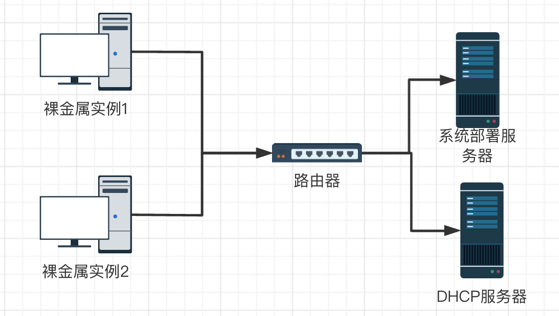
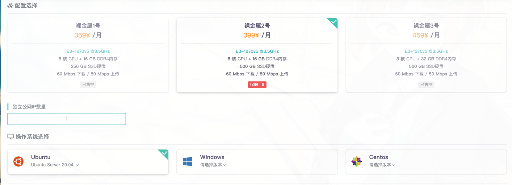

经过长达2个月的开发时间，雨云裸金属物理机（**R**ain **B**are **M**etal）总算与大家见面了！

裸金属到底是什么？有什么用？和普通服务器有什么区别呢？这篇文章将详细为您介绍。

<!--truncate-->
# 裸金属，裸在哪里？
简单地说，裸在没有虚拟化技术的开销。用户相当于在使用一台完全访问和控制物理服务器。这台服务器只有你用，而没有其他人与你共用硬件资源。

## 普通的云服务器是怎么样的
市面上有很多VPS或者云服务器（两者的区别是前者不能弹性变更以及比后者少了一些特性），您可能已经耳熟能详，但是其实他们都是基于不同的**虚拟化技术（Virtualization Technology）**，原理是把一台物理服务器通过资源隔离的技术分成若干个虚拟机，本质上租用给您的只是其中的一台虚拟机，您没有访问其他虚拟机的权限。

虚拟机并不是没有好处，最大的特点是弹性。这也是为什么各种云厂商都把自己叫做弹性云服务器，弹性就弹性在可以动态地删减配置，我们物理机要插内存条，加硬盘，对于虚拟机来说，却只是改个分配参数的事情。

所以用户可以用较低的成本获得一台24小时运行的服务器。但是如果您自己的电脑是8核心16GB内存，如果您在相同的配置开一台8核心16GB的虚拟机，性能一定不如您的物理机，这是因为虚拟化技术是有性能开销的，资源的隔离，虚拟机的管理，地址转换等都会产生开销。

多数知名云服务器厂商都采用硬件辅助虚拟化技术（hardware-assisted virtualization），例如雨云，也采用了此种技术，这种技术在硬件的帮助之下，可以最大程度减少性能损耗，提高云服务器的性能。

但是或多或少，基于虚拟化技术的云服务器及VPS，还是存在一定的性能损耗。而且会面临来自其他用户滥用的风险，一旦同节点的其他用户被黑客入侵，有可能对您的云服务器产生影响，特别是如果提供商没有做安全措施的话。

## 裸金属服务器
既然是一台完全访问和控制的物理服务器，为什么不干脆叫物理服务器呢？因为裸金属服务器通过自动程序控制，可以**自动完成操作系统安装、开机、关机、查看屏幕等的功能**。

这个特点就和普通物理服务器区别开来💡。

我们知道，服务器一般都放在专业的机房里面，如果没有自动化的话，技术人员需要到服务器那插上安装盘，然后像我们给普通电脑装机一样装系统，配置网络，用户等，相当繁琐。

那他们是如何实现的呢？

目前主流的自动化实现还是依据 **预启动执行环境，即 PXE（Preboot eXecution Environment）**

工作方式非常简单，大家看下图：

裸金属服务器都连接到了路由器，然后每台裸金属服务器都已经设置了第一启动项为网络启动，当从网络启动时，DHCP服务器会负责返回一个IP地址给裸金属服务器，而且告诉这个服务器，PXE服务器在哪里。

随后这台服务器就会进入到PXE服务器预设的环境中，加载安装脚本，执行安装与部署，这样就可以给用户一台可用的服务器了。

## 雨云裸金属服务器

介绍了半天背景知识，总算说到雨云裸金属服务器。

有人说雨云的裸金属服务器太便宜了。这是因为雨云采用开源技术+自研技术结合的方法，不用向商用软件交巨额授权费，当然可以把这部分成本省下来让利给用户，这也是雨云所有产品的一贯宗旨。

第一批雨云裸金属服务器在美国2区可用，大家可以在 [购买裸金属独立机] 处选购。

### 特点
+ 全SSD存储，超过1GB/s读写速度，不限I/O。
+ 高达500G硬盘32G内存的高端配置。
+ 提供Windows 2019系统、Ubuntu与CentOS多系统可选。
+ 全自动化装机，支持IPMI硬关机开机功能，不惧死机，真正让物理机和云服务器一样用。
+ 支持多IP功能，最多可以附加高达**30**个IP地址，同时可以自动增删。
+ **在每一次其他用户用完后自动执行硬件检查，绝不会为用户分到快挂掉的硬盘危害您的数据安全，这也是雨云的一大特点，安全**
+ 大带宽、优质9929线路，中国路由优化，网络连接速度超快。
+ 支持试用，支持7天无理由退款，这是雨云的又一大特色，多数厂商不敢承诺7天。

[购买裸金属独立机]: https://app.rainyun.cc/apps/rbm/buy

