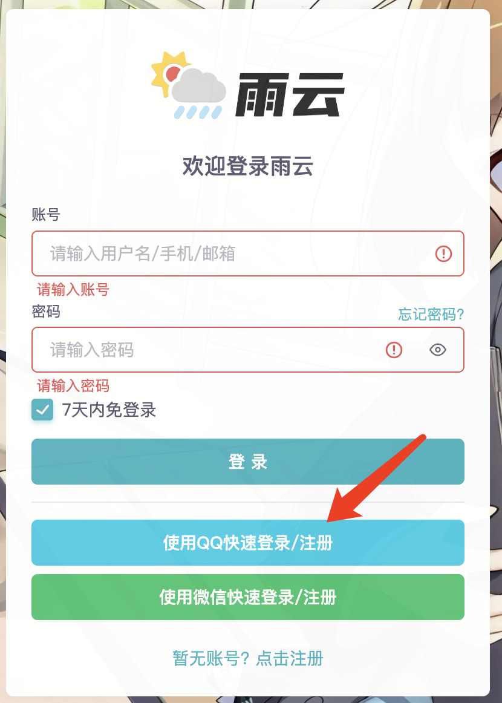

# 绑定信息

您可以在[账户设置][account-settings]页面为雨云账号绑定各种信息，目前雨云支持如下信息绑定：

* 邮箱
* 手机
* 微信
* QQ
* 支付宝

绑定这些信息各有用途，下面进行详细的介绍。

### 📮 绑定邮箱与手机

绑定邮箱和手机号码是雨云的基本验证方式，通过邮件和手机，雨云可以向您发送产品到期的通知信息，提醒您进行续费。雨云也会在征得您同意的前提下为您发送推广和活动信息。

#### 操作步骤

1. 在左侧菜单中点击“绑定邮箱&手机”。
2. 输入要绑定的邮箱或者手机号码。
3. 点击绑定按钮。
4. 随后雨云将会向您的邮箱或者手机发送验证码，请查阅您的邮箱或者手机并复制。

   :::caution

   如果您收不到验证码，通常是因为被当做垃圾信息拦截了，请查看邮箱或手机短信的垃圾箱，看看是否被意外拦截。如果多尝试一会儿还是不行，请邮件联系我们的支持邮箱：admin@rainyun.cn

   :::

5. 回到雨云，在弹出的输入框中输入验证码，点击完成即可。

### :penguin: 绑定QQ与微信

绑定QQ、绑定微信的用处是快速登录雨云，绑定后您可以在雨云的登录页面选择通过QQ或者通过微信快速登录，这样可以不必输入密码就可以快速登录雨云了。

1. 在左侧菜单中点击“绑定QQ&微信”。
2. 点击绑定微信或者QQ。
3. 根据提示进行操作，通常需要扫码或者在手机上确认登录。
4. 完成后您会被重定向回雨云，并提示您已完成。

### :moneybag: 绑定支付宝

绑定支付宝是为了在进行积分提现的时候可以知道您的账号，以便雨云为您转账。

#### 操作步骤

1. 在左侧菜单中点击“绑定支付宝”。
2. 输入您的支付宝账号（建议附上用户名以便雨云进行核对）。
3. 点击保存即可。

### :link: 解绑信息

如果您的某些信息已经更改，或者您不再使用雨云，可能想要把绑定的信息进行解绑，您可以用所绑定的邮箱向admin@rainyun.cn发送说明邮件，可以要求将您要求的个人信息从雨云移除，以便您重新绑定。

[account-settings]: https://app.rainyun.com/account/settings