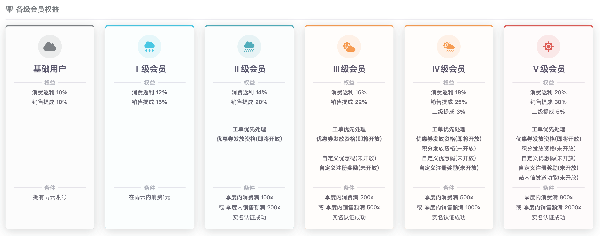

# 雨云会员

雨云会员是您在雨云平台的权益体现。

一共分为六个等级，各个等级有不同的权益，具体请见下图：

### 查看雨云会员等级

您可以在[会员中心]查看您当前的雨云等级，并可以查看要升级到下一级的条件。

### 升级雨云会员

升级雨云会员等级非常简单，只需要满足特定的季度消费额，或者邀请他人完成季度销售额目标。

升级是自动的，当您满足条件升级的时候，您会收到来自雨云发出的邮件和微信通知，告知您升级到什么会员。

:::tip
3级以上会员需要实名认证后才可升级。
:::

### 会员降级

Ⅲ 级或以上会员将进行定期评级，如果您的季度消费额度或者销售额未达到您当前等级的标准，将会自动降级到满足的等级。

:::tip

例如，如果您现在是III 级会员，但是本季度消费了150元，不满足III 级会员的条件，将降级到II 级会员，因为满足II 级会员的条件：消费满100元。

:::

[会员中心]: https://app.rainyun.com/vip