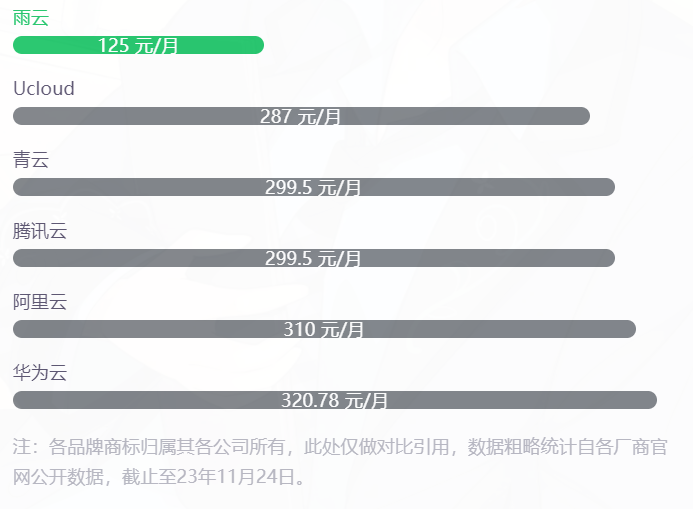

# 对象存储介绍

对象存储（Object Storage）是一种存储数据的技术和架构，用于管理海量的非结构化数据。与传统的文件系统和块存储相比，对象存储采用了不同的方法来组织和访问数据。

在对象存储中，数据以对象的形式存储，每个对象都有一个唯一的标识符（通常是一个URL）。对象通常包含数据本身以及与之相关的元数据（如文件名、文件类型、创建日期等）。这些对象可以按照需要进行组织和分类，并且可以通过网络进行访问和检索。

---

## 为什么选择雨云对象存储？

* 精细权限管理
不同存储桶设定不同密钥，保障数据安全。
管理员使用实例密钥统一管理存储桶，简化权限管理。

* 可选弹性计费
担心使用量超出套餐限制？
我们提供了弹性计费功能，您可以根据需求自由开启或关闭，灵活控制成本

* 便捷文件管理
内置简易文件管理面板，方便管理和操作存储的文件。
无需第三方文件管理系统，轻松完成文件管理任务。

* 价格优势
我们提供了竞争力的价格和灵活的计费方式，帮助你在控制成本的同时，享受到优质的服务。

## 我们提供灵活的计费方式，以满足您的需求

提供了多种套餐选择，满足不同用户的需求。

*  平衡套餐
   
存储和流量平衡，提供相等的存储和流量配额，满足您对存储和传输的均衡需求。

* 存储优先套餐
  
存储容量优先，提供较大的存储和相对较小的流量配额，适合需要大量存储空间而对流量需求较小的用户。

* 流量优先套餐
  
流量优先，提供较小的存储和较大的流量配额，适合对流量需求较大而对存储空间需求较小的用户。

套餐内的优惠价格如下：
- 流量：每GB仅需 0.2 元。
- 存储：每GB每月仅需 0.05 元。
如果您超出了套餐限制，我们也提供了以下计费方式：
- 存储：每GB每月仅需 0.12 元。
- 流量：每GB仅需 0.5 元。
请注意，超出套餐部分的使用需要开启弹性计费功能才可生效。

如果您选择不开启弹性计费，您的使用量将受到限制。

**对比友商对象存储，雨云计费具有更高的价格优势**

以每月使用500GB存储和500GB流量为例，友商和雨云的计费对比如下：

**雨云在对象存储上，加入了四大特色**

* 弹性计费，自研后台，一元试用，七天无理由

#### 弹性计费

弹性计费是雨云可以保证**性价比和稳定**两者的关键

担心使用量超出套餐限制？

我们提供了弹性计费功能，您可以根据需求自由开启或关闭，灵活控制成本。

#### 自研后台，强大功能

所有优秀机制，离不开雨云为用户精心自研的管理系统，

同时提供实时监控系统，创建存储桶，随心更换套餐，域名管理，访问控制、性能优化等强大功能。

---

更多售前售后服务和使用教程，可在官网内咨询客服噢