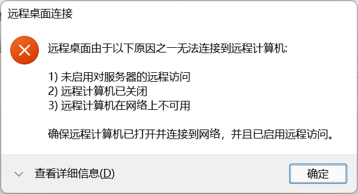
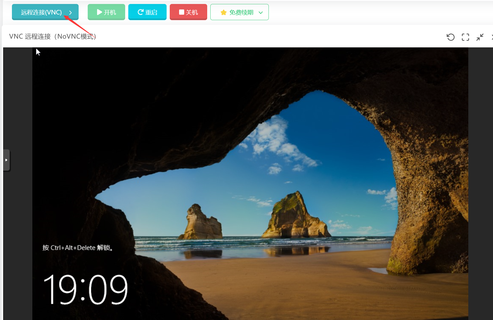
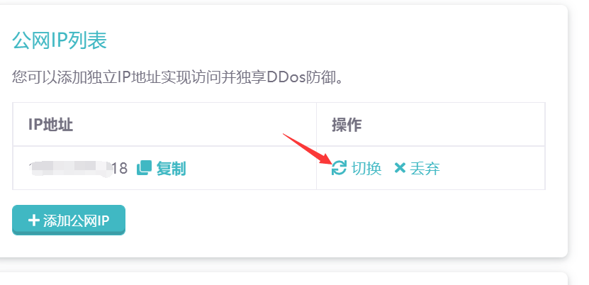

# Windows 无法连接问题

在使用Windows服务器系统时，我们可能会遇到下面这些问题：

:::info
我们没有经过任何设置，为什么远程桌面无法连接？

新买的服务器，为什么远程连接不上？

我们重装了几次系统，为什么还是无法连接上服务器？
:::

### 检查方案

#### 方法1.NAT端口检查

如果购买的是NAT服务器（没有独立IP）的话，先检查端口映射，内网端口需要为3389。
然后，使用对外地址来远程服务器。

#### 方法2.防火墙规则

默认情况下，NAT服务器或者是有独立IP的服务器，防火墙规则都是不用去动的。
有独立IP的话，所有端口（除了部分机房限制外）都是开放着的。

无需新建任何防火墙规则,如果有新建的话，请把他删除(删除后，建议重启一下服务器，然后等几分钟)。

然后在[ITDOG][itdog]中的Tcping中测试一下能不能通。

NAT服务器：使用对外地址进行测试。

独立IP：使用独立IP:3389进行测试。

如果非红色，说明通了。

### 解决方案

#### 方法1.更换远程工具

系统自带的远程工具有时候会因为网络原因导致无法正常连接到服务器。

1. 可以更换成微软的远程工具 [Microsoft Remote Desktop][Microsoft Remote Desktop]来远程到服务器。

2. 使用服务器面板自带的远程工具 VNC 进来连接。
   
   

如果觉得每次使用VNC不方便，可以在服务器安装一下向日葵远程连接工具。

#### 方法1.更换IP

:::caution
这个方法，只限于有独立IP的服务器。
:::

当上面两者检查方法都试过后，仍然无效的，请尝试切换一个IP，然后重启一下服务器，等待几分钟后再试。

[itdog]: https://www.itdog.cn/tcping
[Microsoft Remote Desktop]: https://apps.microsoft.com/detail/9WZDNCRFJ3PS?activetab=pivot%3Aoverviewtab&hl=en-us&gl=US
