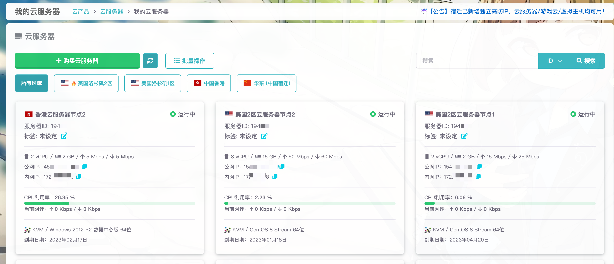

# 服务器列表

您可以在[服务器列表]处查看您的服务器列表，可以查看到一些基本的信息。

如果云服务器数量很多，还可以使用这里的搜索功能，或者按区域查看服务器。

这里可以获取到的信息：

- 公网和内网IP地址
- 配置信息
- CPU使用率等监控信息
- 虚拟化技术和操作系统
- 到期时间

通过点击对应的服务器卡片可以进入服务器的管理面板，简洁易用。

[服务器列表]: https://app.rainyun.com/apps/rcs/list