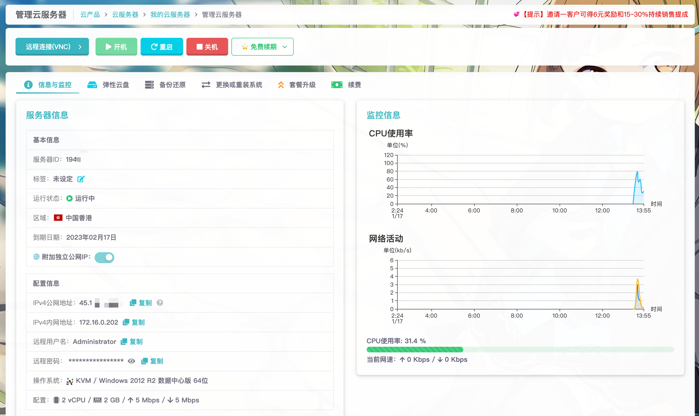

# 服务器管理

雨云从2020年的第一代开始就自研服务器管理面板，经过不断改良，沿用至今已是第三代。

在面包屑导航下方，有**远程连接、开机、重启、关机等功能**，这是管理服务器最常用的功能。

在主区域可以看到**信息与监控、弹性云盘、备份还原、更换或重装系统、套餐升级、续费**等这几个选项卡。点击就可以查看相应的界面。

## 🔗 远程连接

根据您在创建时选择的操作系统，有不同的远程连接方法。

如果服务器工作正常，首选的连接方式是通过**SSH（Linux系统专用）**或 **Windows RDP（Windows系统专用）**进行远程连接，这样的使用体验比较好。

### 连接信息

如果购买时选择了附加公网IP，则可以直接使用 **信息与监控 -> IPv4公网地址 **来进行连接。

:::tip

如果没有附加公网IP，则需要在[端口映射]处添加一个到内网22端口的，TCP协议的映射，即可通过外网地址+外网端口来访问

:::

#### Linux SSH

如果选择的是Linux系统，您可以通过SSH连接到服务器，用户名通常是root。

推荐使用[Tabby]这个软件，支持SSH连接，还集成了SFTP的功能，可以快速进行文件管理。

#### Windows RDP
如果选择的是Windows系统，则一般使用微软的远程桌面连接功能（RDP）连接到服务器，就像操作自己的电脑一样，很方便。

一般的Windows10、Windows11的系统已经预装了RDP功能，点击屏幕左下角或中下方的Win图标，又或者按下Win键，输入远程，就会看到远程桌面连接，输入您服务器的公网地址即可进行远程连接。
用户名通常是Administrator

[Tabby]: https://github.com/Eugeny/tabby
[端口映射]: nat

