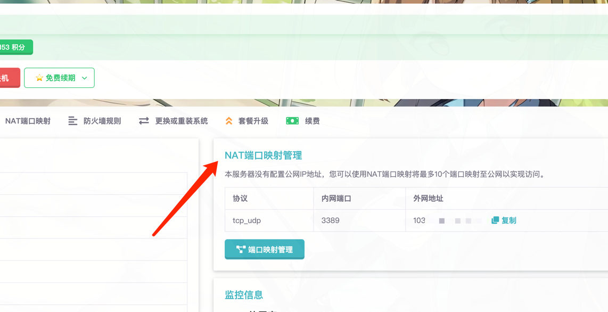
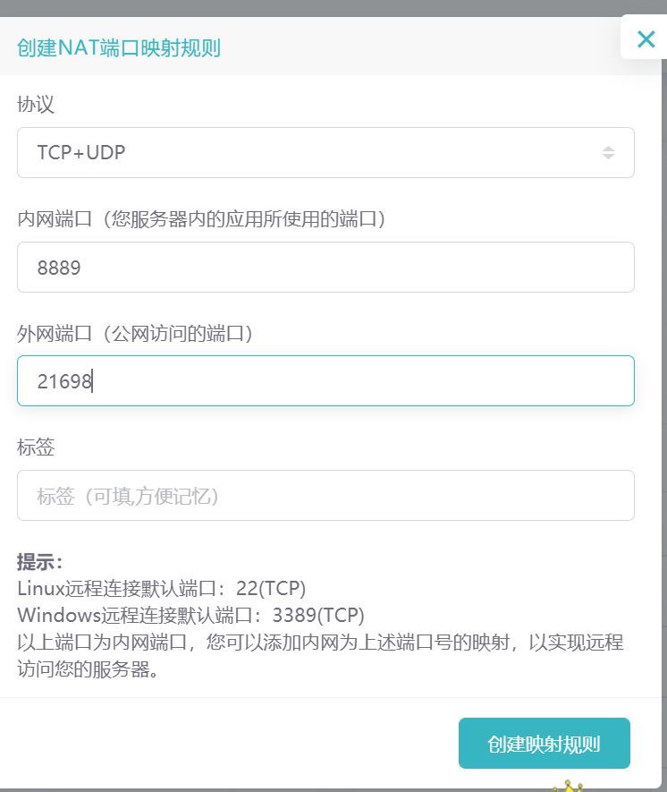

# NAT端口映射

:::info
本篇教程仅供非独立IP的用户使用，如果您有独立IP，不需要参考下述内容。
:::

> 🌏 **网络知识：**
> 
> NAT (Network Address Translation) 端口映射是一种网络技术，它允许在一个局域网内的多台设备共享一个公网IP地址。NAT端口映射的原理是，当局域网内的设备向外部网络发送数据时，NAT设备（如路由器）会将数据包中的源IP地址和源端口号替换为公网IP地址和一个可用的端口号，并记录下这个映射关系。当外部网络返回数据时，NAT设备会根据映射关系，将数据包中的目的IP地址和目的端口号替换为局域网内的设备的IP地址和端口号，并将数据包转发给该设备。这样，就实现了在一个公网IP地址下，同时进行多个网络连接的功能。

## 为什么要使用

如果您的服务器是共享IP，但是您在服务器上开了一个游戏服务器，或者网站，又或者您编写的伟大程序，要怎么实现让其他人也可以访问呢？🤔

如果是独立IP的话，通常外面的人使用 `您的服务器IP:服务端口` 就可以访问到您的服务，但是对于共享IP，我们需要设定一条NAT规则，这样就可以让外部的链接可以访问本地服务器上的服务。

## 重要概念
在使用之前，我们首先捋清楚一些重要概念，理解了之后，才知道如何创建规则。

## 使用方法
在服务器管理面板（从服务器列表点进去）的右侧会有一个NAT端口管理，在这里可以快速预览目前服务器有哪些端口映射规则。

跟随指引，进入 **端口映射管理**

:::info
为了方便您的使用，刚创建的云服务器会自带一个端口映射，规则根据您选择的不同系统，会创建内网22端口（Linux）或内网3389端口（Windows）的映射。您可以直接使用外网地址连接到服务器。
:::

### 创建规则

1. 首先选择协议，请根据您的服务来选择，例如网页服务通常是TCP协议，但是如果不清楚，那选择TCP+UDP是最保险的。
2. 然后填入内网端口，请参考 [重要概念](#重要概念) 处的说明，填写您本地服务所使用的端口。
3. 接下来写外网端口，通常这有限制，您不能使用一些常用的端口，因为这会对其他用户不公平，例如80,443,25565等都是不行的，如果您要用这些端口，请购买附加独立IP使用。

创建完毕后，您可以在端口映射列表处看到，通常需要1-2分钟来使映射生效。

### 宝塔案例

:::tip  
下边是新客户常会碰到的一个问题

当我们购买的云服务器时，如果安装的是宝塔面板，访问宝塔管理面板会弹出 没有绑定公网IP，需要映射内网端口的信息，这就
需要我们对内网8889端口进行映射操作
:::    

1. 创建NAT端口映射，设置内网端口为 8889

1. 创建完成之后，如何访问我们的宝塔面板？

:::tip  
访问方式：IP:外网端口/rainy 或 对外地址/rainy

在上方，我们映射好内网8889端口后，会生成一个对外地址，我们即可采用对外地址/rainy的方式可以访问到我们的宝塔面板了

假设，我们的对外地址是 194.168.12.2:2023 那么，我们的宝塔访问地址就是 194.168.12.2:2023/rainy
::: 