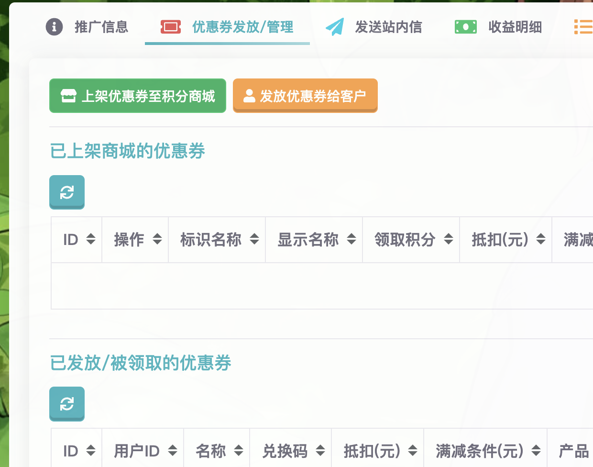
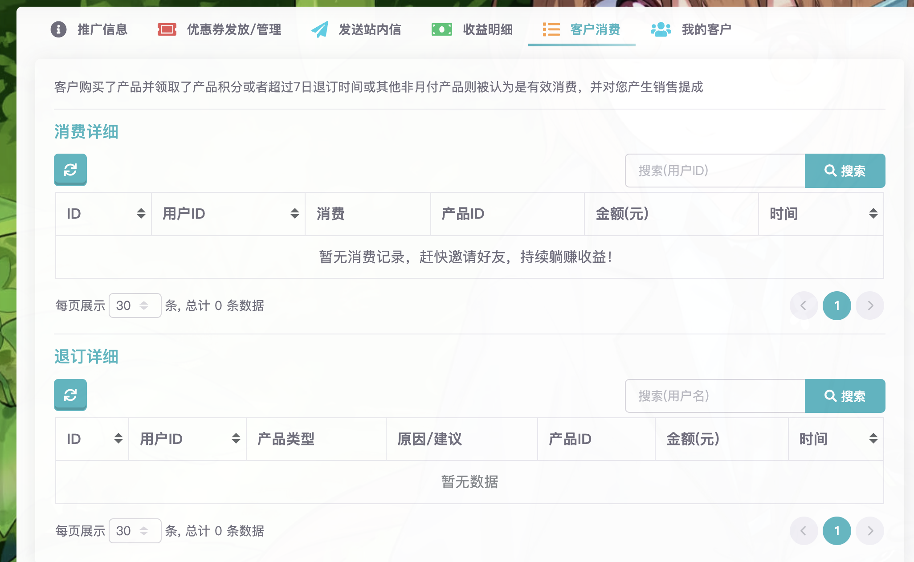

# 推广中心

雨云有一整套独特且完整的推广体系，您可以从中获益。

[推广中心]是雨云提供给您的一站式推广管理中心，在这里可以查看您的推广情况，发优惠券给客户，发站内信给客户等，还能看到您的推广客户列表，查看您的收益，欢迎每一位雨云用户成为雨云推广大使👏🏻！

通过推广客户，您可以从中赚取收益，您邀请地越多，客户消费越多，您的雨云会员等级就越高，同时您的收益也就越高。最高可达30%的收益。

## 面板

在面板上可以查看您的会员等级、也可以看到一些推广数据的概览。

包括本月的总收益、历史的总收益、今日的销售额（即客户的消费金额）、本月的销售额、 

## 获得客户

有两种获得推广客户的方式，使用每位用户专属的推广链接或者优惠码：

1. 他人使用您的推广链接来到雨云注册，未注册的用户通过您的链接注册雨云账号将自动绑定成为您的客户。
2. 让他人在注册的时候填入您的优惠码，这样也可以绑定。

推广链接和优惠码可以在[推广中心]看到。

:::tip

注册的时候如果有类似这样的字样代表已成功锁定客户，注册将会成为您的客户，享受分成！

通过是通过您的推广链接来到雨云，但是没有显示如下的字样，请给优惠码给您的客户填写。

:::

### 推广文案

推广信息处已经为您编写好了一些推广用的文案，您可以直接复制粘贴这些文案到**Q群、贴吧、论坛、B站、知乎**等各种渠道

### 发放优惠券给客户

为了吸引客户提高收入，您可以利用您的积分以非常优惠的价格生成您的专属优惠券发放给您的客户，以吸引他们进行消费。

一个优惠券有他的准许使用的最低价格，或者是针对特定的产品，优惠相应的金额，用户可以使用这个优惠券在购买的时候选择，并且得到优惠。

您可以在推广中心生成新的优惠券，上传到积分商城，或者直接生成专属的优惠券直接发放到客户的账号内。

#### 上架到商城

您可以生成新的优惠券并发放到积分商城，这些优惠券只有您的邀请人才能看得见，非您的客户不会再积分商城看到。

上架1张优惠券积分消耗=(优惠券抵扣x1000)-领取需求积分，**例如您生成了一张1000积分可以抵扣10元的优惠券，会扣除您(10x1000)-1000=9000积分。**

会有如下效果：

- 优惠券上架商城后，可以供您邀请的所有客户领取（抢券），实现活动促销和更低的价格。
- 您可以随时在此处推广中心下架您上架在积分商城的优惠券，这会为您全数退还积分。
- 领取但未使用的优惠券会在优惠券过期后被收回(用户进行退订时也会退回已使用的优惠券)，收回时候将为您退还全部积分。

#### 发放优惠券给客户

对比上架到商城，这个方式可以直接把优惠券送到客户的手上，不需要客户去积分商城抢购，这个适合针对某个客户的专属活动。

发放1张优惠券积分消耗=优惠券抵扣x1000

## 发送站内信

如果您上架了优惠券，或者有其他活动、通知，您可能想要批量通知您的客户，您可以在[推广中心]发布站内信，可以针对一个用户发送或者发送给您的全部客户。

您可以自定义通知的标题或者内容。

## 查看您的收益

在客户消费处，您可以查看您的消费收益明细。

只有客户产生了有效消费，您才能获得相应的收益。所谓有效消费，即客户购买了产品且领取了消费积分，或者在7天时间内没有退订，即可认为是有效消费。您会收到按照您的[雨云会员]等级的比例分成，以积分的形式赠送给您消费提成。

您获得了积分，要如何使用或者变现呢？请查看[积分机制](points.md)。

[推广中心]: https://app.rainyun.com/agent
[会员中心]: https://app.rainyun.com/vip