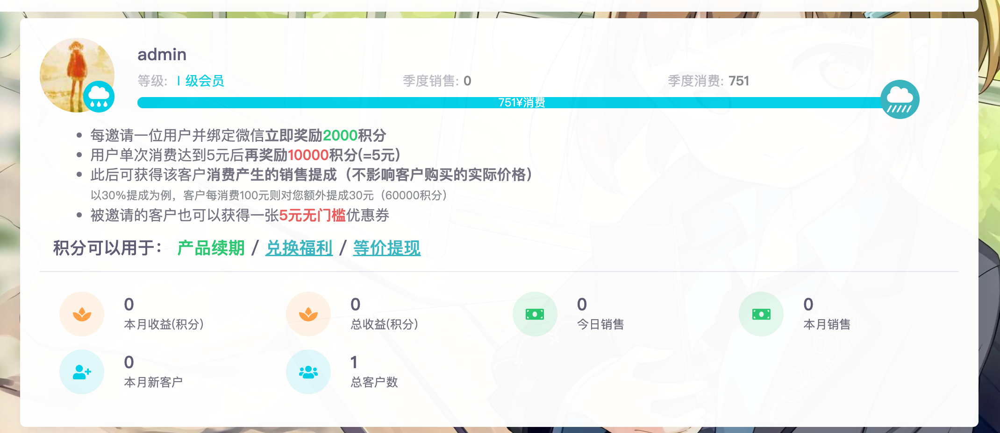
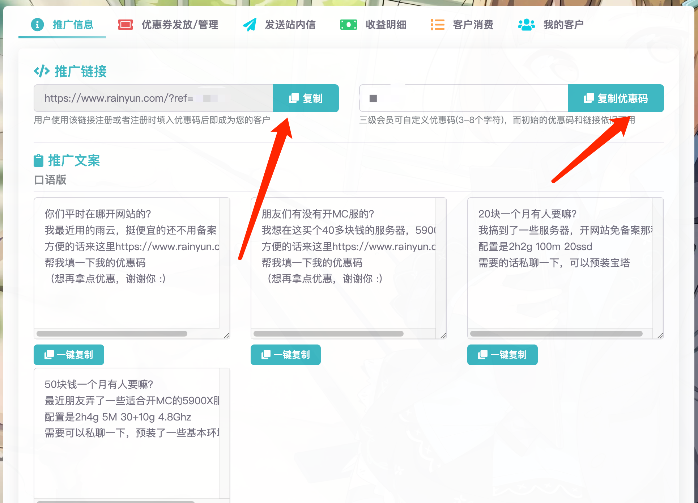

# 推广中心

雨云有一整套独特且完整的推广体系，您可以从中获益。

[推广中心]是雨云提供给您的一站式推广管理中心，在这里可以查看您的推广情况，发优惠券给客户，发站内信给客户等，还能看到您的推广客户列表，查看您的收益，欢迎每一位雨云用户成为雨云推广大使👏🏻！

通过推广客户，您可以从中赚取收益，您邀请地越多，客户消费越多，您的雨云会员等级就越高，同时您的收益也就越高。最高可达30%的收益。

### 面板

在面板上可以查看您的会员等级、也可以看到一些推广数据的概览。

包括本月的总收益、历史的总收益、今日的销售额（即客户的消费金额）、本月的销售额、 

### 获得您的客户

有两种获得推广客户的方式，使用每位用户专属的推广链接或者优惠码：

1. 他人使用您的推广链接来到雨云注册，未注册的用户通过您的链接注册雨云账号将自动绑定成为您的客户。
2. 让他人在注册的时候填入您的优惠码，这样也可以绑定。

推广链接和优惠码可以在[推广中心]看到。

:::tip

注册的时候如果有类似这样的字样代表已成功锁定客户，注册将会成为您的客户，享受分成！

通过是通过您的推广链接来到雨云，但是没有显示如下的字样，请给优惠码给您的客户填写。

:::

#### 推广文案

推广信息处已经为您编写好了一些推广用的文案，您可以直接复制粘贴这些文案到其他地方

#### 为客户发放优惠券

[推广中心]: https://app.rainyun.com/agent