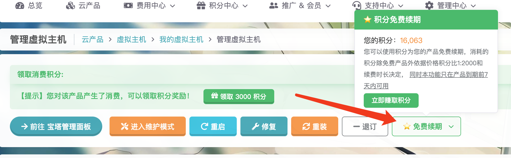

# 积分机制

积分是雨云激励用户的首要方式，获得的积分可以兑换优惠券、免费续期等多种用途，最重要的是积分可以按一定比例兑换成人民币，本文为您详细介绍雨云的积分机制。

### 查看雨云积分

通常积分会显示在后台面板的主页上，也可以在[赚取积分]页面看见。

### 获得积分的途径

获得雨云积分有如下几种途径。

1. 通过兑换产品积分获得，这是获取积分的主要形式。

   多种产品的新购或者续费会赠送积分，例如云服务器、虚拟主机、游戏云等，会按照您的购买金额为您返还一定比例的积分。

   如果您的产品可以领取积分，则在产品的管理页面可以看到。

   

   :::caution

   领取产品积分后将无法进行产品退订，即使是发起工单也无能为力，请确保您的需求后再领取产品积分。

   :::

2. 通过完成[积分任务]获得。

   在赚取积分页面，您可以完成特定的任务，包括每日签到、绑定各种信息、加入Q群等任务，点击”去完成“可以前往完成任务，点击”领取奖励“即可领取特定任务的积分。我们可能会随时变动这部分的积分任务，恕不另外通知。

3. 通过邀请新客户获得收益，也称推广联盟收益。

   这个方式是我们推荐的形式，通过我们的[推广联盟]，您可以通过您的推广链接或者邀请码邀请您的朋友购买雨云产品，您会从他的消费中获得积分奖励。

3. 通过后台赠送。

   如果您参与了雨云发起的有奖活动，雨云客服可能会在后台为您赠送特定的积分。

### 积分的用途

雨云积分大致有如下用途：

1. 兑换免费产品。

   雨云有很多产品可以免费领取，包括免费CDN，免费虚拟主机、云服务器、游戏云等等，这些免费产品具有体验性质，您可以使用这些免费产品体验雨云的服务。

   在[积分商城]可以兑换。

2. 兑换优惠券。

   优惠券可以用在新购或续费时用，雨云大多数的优惠券都是无门槛优惠券，非常实惠。

   在[积分商城]可以兑换。

3. 通过积分免费续费产品。

   

4. 提现。

   提现是大家最喜欢的用途了！毕竟可以换成真金白银。

   您可以在[积分提现]页面发起提现申请，具体的比例以具体页面的显示为主。

[发起工单]: https://app.rainyun.com/support/workorder/create
[工单列表]: https://app.rainyun.com/support/workorder/list
[积分任务]: https://app.rainyun.com/account/reward/earn
[推广联盟]: https://app.rainyun.com/agent
[积分商城]: https://app.rainyun.com/account/reward/store
[积分提现]: https://app.rainyun.com/account/reward/withdraw