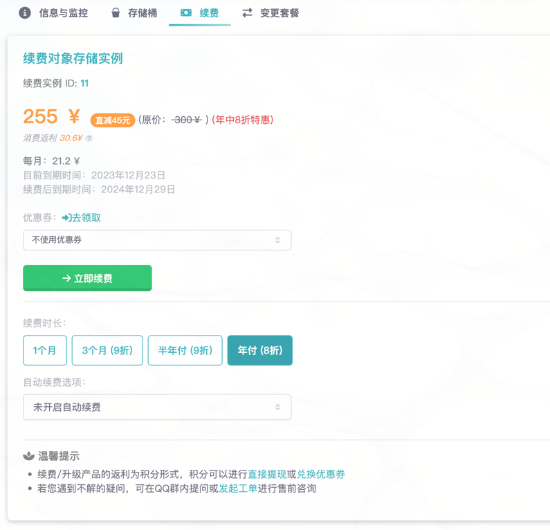
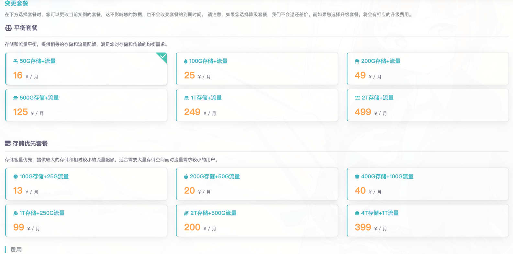

## 续费套餐

如需续费实例，可以前往[对象存储](https://www.rainyun.com/apps/ros/list)页面，在左侧找到需要续费的实例，点击管理，页面跳转后点击续费，按照自己的需求选择下单即可。

## 变更套餐

如需变更套餐，可以前往[对象存储](https://www.rainyun.com/apps/ros/list)页面，在左侧找到需要变更套餐的实例，点击管理，页面跳转后点击变更套餐，按照自己的需求选择下单即可。

:::warning
更换套餐后套餐立即生效，更换套餐**不会影响您的数据**，也不会改变套餐的到期时间。 
如果您选择降级套餐，我们**不会退还差价**。而如果您选择升级套餐，将会有相应的升级费用。
:::

## 退款

如果您觉得我们的产品不合适，可以尝试变更套餐选择更适合您的套餐，如果有问题可以给我们发工单，我们会尽快为您解决问题
，如果您依然不满意，可以参考我们的[退款政策](/docs/account/refund)自行操作。

