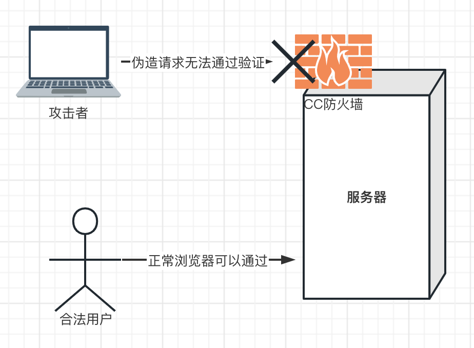

# 防火墙

:::caution

我们正在开发新一代的防火墙，当前的防火墙可能运行不稳定，请谨慎使用。

如果遇到访问问题，请尝试关闭防火墙的全部选项并等待10分钟。

:::

CC攻击是常见的7层网络攻击的俗称。攻击者从广泛的源IP制造巨量的请求、在极其短的时间内以超高的频率发送这些请求到目标网站服务器，从而导致目标服务器疲于应付而瘫痪，无法提供服务。这也是一种分布式拒绝服务攻击（distributed denial-of-service attack，即DDoS）

雨云虚拟主机免费配备应对雨云自主研发的CC防火墙，可以有效帮助用户应对相关网络攻击。相同的系统曾在过去近2年的时间里帮助雨云官网防御CC攻击，并在无数次攻击中不断调优，效果良好。

要配置防火墙，您需要查看雨云虚拟主机管理面板（并非EP/宝塔面板内），在TAB菜单中找到防火墙设置。

防火墙的设置会应用到主机的所有域名上，暂不支持指定域名应用。

### 速率控制

这是基础的攻击防御方法，简单粗暴，却有效。原理是记录每个IP访问的频率，如果在设定的时间内请求次数超过设定的阈值，将会屏蔽这个IP的所有访问一段时间（您可以设置这个时间），而不会去验证请求本身是否合法。

> 比如一个网页 /index.php 里面可能加载了100张图片，10个CSS文件，10个JS文件。这样首次访问的用户会发送高达120个请求，可以在短短数秒内就达到这个阈值，因此设置120就不安全了。

缺点在于很多攻击并非来自单个IP，当攻击来源IP众多，且单个IP访问频次较低时，效果不佳，无法拦截。

阈值应该根据网站实际情况来定，阈值过低可能误封过多用户体验差，阈值过高可能会导致无法拦截恶意请求。

因此建议使用速率控制作为保底方案配合JavaScript验证来使用。

### JavaScript 验证

俗称JS验证。CC攻击的令人头疼的地方在于难以鉴别是攻击者伪造的虚假请求还是真实用户的访问。

JavaScript是一个浏览器功能，因为需要耗费相当的资源，而为了瘫痪目标又需要短时间内制造大量的访问，绝大多数攻击者不会启用JavaScript，因此JS验证是验证请求是否合法的一种方式。

当JS验证启动时，防火墙会自动检查每个请求，并通过JS给用户浏览器发一个“谜题”，启用了JavaScript且支持相应特性的浏览器会自动解出谜题的答案，并且上报给服务器，此时这位用户就会自动标记为合法用户从而放行。

而攻击者的虚假请求到来，如果因为不支持JavaScript，无视这个“谜题”，又或者反复“算错答案”，就会被防火墙标记为非法请求，遭到屏蔽，防止攻击流量进入到用户的虚拟主机，起到防御的效果。

您可以通过勾选来执行自动JS验证（当访问量突增时，验证所有请求）、或者勾选持续开启JS验证（无论何时都对所有请求进行验证）。

[SSL证书中心]: https://app.rainyun.com/apps/ssl/list

