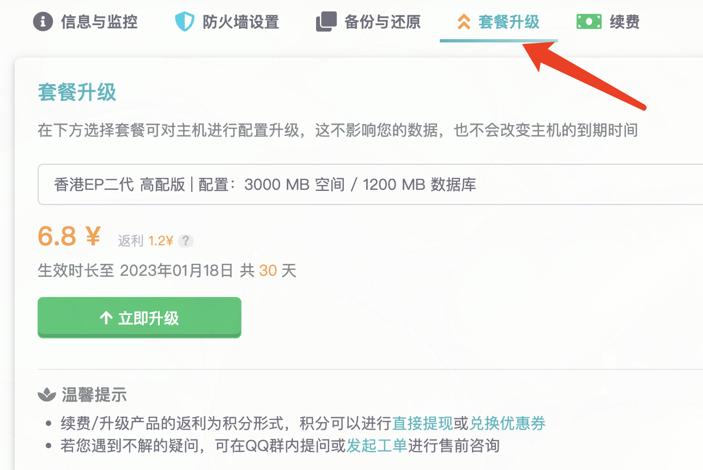

# 套餐升级

当您发现配置不够用的时候，可以使用套餐升级功能升级到更高的配置，只需要补差价，只要主机还没到期，都可以执行升级。

+ 升级不支持使用优惠券。
+ 不会影响现有的主机内的数据。
+ 升级后的到期时长不变。
+ 只需要补差价即可，计算方式为 **(目标套餐的日付价格 - 当前本套餐的日付价格) \* 剩余到期天数**。
+ 不支持重新降级，升级后续费按新套餐价格。

:::info

对于宝塔主机来说，升级操作后如果没生效，可能需要手动点击重启主机。

同时，如果硬盘没扩容，请删除所有快照备份后重启主机试试。

:::

