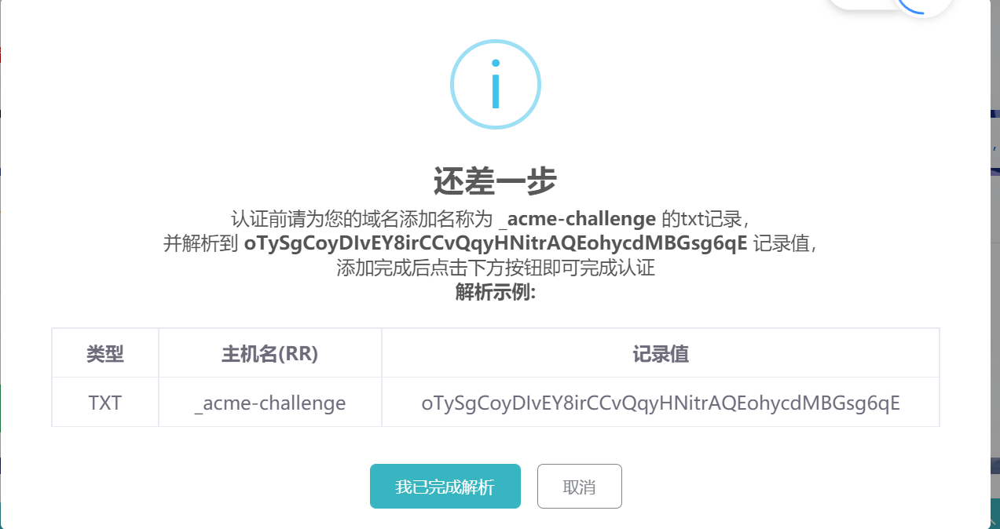

# SSL证书

为什么会需要SSL证书？

:::info
保证用户信息安全：防止信息泄露、被篡改或窃取。

验证网站真实性：帮助用户识别假冒网站，避免中间人攻击，保护企业健康发展。

提高网站排名：有助于提高网站在搜索引擎中的排名。

提高网站的可信度：使用户更信任安全的网站，提高网站的访问量以及交易的成功率。
:::info

### 如何申请SSL证书？

首先进入[域名服务][ssl]界面

然后，在域名列表输入我们的域名 比如 ab.tingyu.icu

然后进入我们的域名DNS界面，下面以阿里云的为例

:::tip
1、记录类型 选择 TXT

2、主机记录，输入 _acme-challenge.二级部分  例如我的是 _acme-challenge.ab 

3、把记录值复制过去即可
:::

最后，等一两分钟，再单击一下 “我已完成解析” 这样就成功创建SSL证书了。

### 如何上传自己的SSL证书？

1、单击“上传证书”

2、SSL证书（注意！Nginx格式）
  
   证书内容（.crt）

   密钥内容（.key）

   请直接打开对应文件，全选复制所有内容，然后粘贴到指定的框内，最后单击“保存证书”。
[ssl]: https://app.rainyun.com/apps/ssl/list