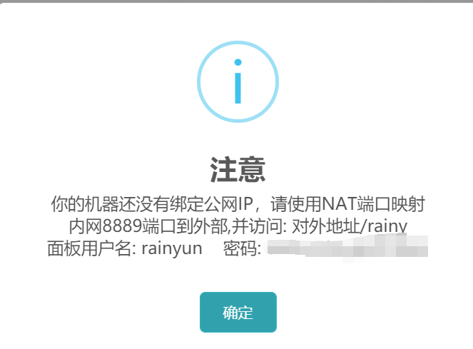
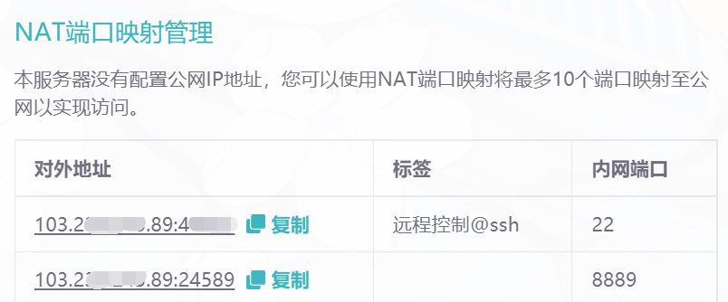

# 端口映射
  
   NAT服务器需要我们正确的映射端口，才能保证我们可以正常的访问服务
  

## 映射教程
:::tip  
当我们购买的NAT服务器，安装的是宝塔面板时，会要求我们自行创建内网端口为8889的映射，才可以使用外网进入服务器

如果我们开的是Minecraft服务器，就需要把内网端口设置为 server.properties 文件中 对应的 server-port 端口
:::     
### 普通端口映射
  
1. 进入服务器后台面板 的 NAT 端口映射 界面
   
   

2. 新建端口映射 
   
   
:::info
  内网端口填写自己需要开放的端口，比如Mysql是3306

  外网端口，可以是系统随机生成的，也可以自己指定，如果我们指定的端口被占用了，有以下两个方法
   1. 更换另外一个外网端口
   2. 如果业务需求只能选择这个端口，我们需要额外购买1个独立IP
   
   需要注意的是，我们创建的端口映射，需要使用IP+外网端口进行访问，而不是使用内网端口。
   
:::

3. 最后单击 创建映射规则 即可完成端口映射

### 云服务器宝塔端口映射

:::tip  
下边是新客户常会碰到的一个问题

当我们购买的云服务器时，如果安装的是宝塔面板，访问宝塔管理面板会弹出 没有绑定公网IP，需要映射内网端口的信息，这就
需要我们对内网8889端口进行映射操作
:::    

1. 创建NAT端口映射，设置内网端口为 8889

2. 创建完成之后，如何访问我们的宝塔面板？

:::tip  
访问方式：IP:外网端口/rainy 或 对外地址/rainy

在上方，我们映射好内网8889端口后，会生成一个对外地址，我们即可采用对外地址/rainy的方式可以访问到我们的宝塔面板了

假设，我们的对外地址是 194.168.12.2:2023 那么，我们的宝塔访问地址就是 194.168.12.2:2023/rainy
::: 
   

  
  