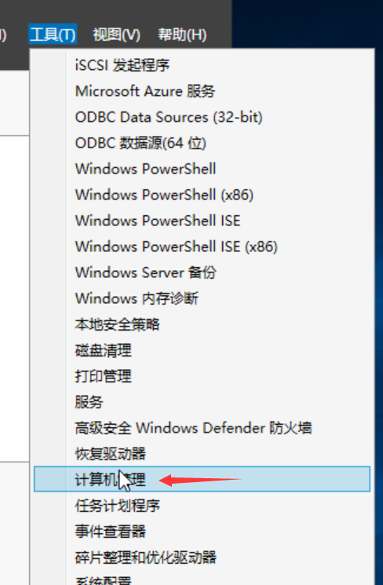
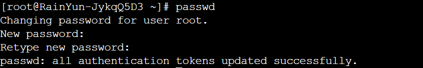

# 修改密码
  
   修改密码是为了 方便我们记忆，同时也是为了提升安全性，防止数据泄露和不必要的损失。
   为了更好地保护您的服务器和数据安全，我们建议您按照以下步骤定期修改操作系统密码：
  

### 修改步骤
:::tip  
当前雨云服务器后台面板暂不支持直接修改，需要我们自己在操作系统当中修改，修改之后，
最新的密码不会在后台面板更新，需要我们自己记住修改后的密码！
:::     
### Windows Server 
  
1. 进入服务器之后，打开服务器管理器界面
   
   
  
2. 在右上角选择“工具”->"计算机管理"
   
   
   
3. 选择 “本地用户和组” -> 双击 “用户” 进入 -> 选择 “Administrator” 并右键 选择 “设置密码” 
   
   

4. 设置成功之后，记得重启服务器和记住我们设置的密码

### Centos、Ubuntu、Debian等Linux系统    

1. SSH连接并登录到我们的服务器

2. 输入 passwd 然后 Enter 回车

3. 根据提示，输入我们要更改的密码
   
   
   
:::tip
 “New password” 输入我们要修改的新密码，然后 Enter 回车。 注意，输入的密码是不会显示出来的

 “Retype new password " 再次输入我们刚才输入的新的密码，然后 Enter 回车。
     
 “passwd: all authentication tokens updated successfully.” 或者包含 “successfully”时，说明我们的密码已经修改成功了。
:::tip

   ##### 4、设置成功之后，记得重启服务器和记住我们设置的密码
     

