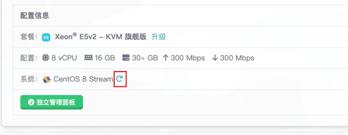

### 硬盘扩容后，空间还是显示原来的大小？

如果扩容后硬盘还是与原来的大小一样，可以参考下方教程解决。

#### Windows:

进入**服务器管理器**，磁盘管理，找到要扩展的分区，右键扩展卷，按提示完成操作即可。

#### CentOS 7 / CentOS 8 / RockyLinux 8 / RockyLinux 9:

SSH进入服务器后执行以下命令：

```shell
yum install cloud-utils-growpart gdisk xfsprogs e2fsprogs
```

使用 `fdisk -l `命令根据大小及其他信息查看要扩容的云盘，本例子中要扩容的分区为/dev/sda1

``` shell
growpart /dev/sda 1
```
##### centos 7 使用
``` shell
resize2fs /dev/sda1
```
##### centos 8 / rockylinux 8 / rockylinux 9 使用
``` shell
xfsprogs  /dev/sda1 或者 xfs_growfs /dev/sda1
```

#### Ubuntu/Debian：

```shell
apt install cloud-guest-utils
apt install xfsprogs
```
使用 `fdisk -l `命令根据大小及其他信息查看要扩容的云盘，本例子中要扩容的分区为/dev/sda1

执行命令：
```shell
growpart /dev/sda 1
resize2fs /dev/sda1
```

:::tip
注意：如果您把系统设置成了中文，在运行growpart命令之前必须先运行：LANG=en_US.UTF-8
，否则会报错如： unexpected output in sfdisk --version
:::

### 访问网站出现 Kangle is OK!! 提示？

如果遇到此问题，一般有以下情况：

1. 域名尚未在EasyPanel面板绑定。
2. 如果您是使用免费二级域名，则选错了解析区域，请注意 目标区域必须是主机所在的区域，比如香港的主机，选择区域则要对应选香港 。
3. 如果您搬迁了虚拟主机，则要重新修改解析到目标区域，如果是免费二级域名，则要删除原解析，新增解析，区域选择到您目前主机所在的区域。


### 怎么重新安装系统
如需重装系统，可以在管理页面，配置信息里点击红框内图标，选择喜欢的系统，点击安装即可。

[](rvh/assets/img_1.png)
:::warning
重装系统会清空所有数据，请谨慎操作。
:::


### 怎么重置密码
如果您忘记了密码，可以在管理页面，点击重置密码，点击确定即可。


### Windows系统无法远程链接


#### 方法1.检查NAT端口


如果购买的是NAT服务器（没有独立IP）的话，先检查端口映射，内网端口需要为3389。 然后，使用对外地址来远程服务器。

####  方法2.检查防火墙规则
默认情况下，NAT服务器或者是有独立IP的服务器，防火墙规则都是不用去动的。 有独立IP的话，所有端口（除了部分机房限制外）都是开放着的。


无需新建任何防火墙规则,如果有新建的话，请把他删除(删除后，建议重启一下服务器，然后等几分钟)。

然后在[ITDOG][itdog]中的Tcping中测试一下能不能通。
NAT服务器：使用对外地址进行测试。
独立IP：使用独立IP:3389进行测试。
如果非红色，说明通了。

#### 方法3.更换工具
系统自带的远程工具有时候会因为网络原因导致无法正常连接到服务器。

1. 可以更换成微软的远程工具 [Microsoft Remote Desktop][Microsoft Remote Desktop]来远程到服务器。
2. 使用服务器面板自带的**远程工具 VNC** 进来连接。

#### 最终方法
如果各种方法尝试均无效，可以发工单联系我们，我们会帮您解决。


### 我的主机不能访问PHPMyAdmin
访问phpmyadmin管理面板时，如果**没有附加独立IP**，请替换管理面板入口链接中的888端口为雨云面板配置信息中显示phpmyadmin的端口（
该链接可在宝塔内点击跳转数据库管理时获得），假如还是无法访问，请在宝塔软件商店内**升级phpmyadmin**到5.2版本并设置其php版本为7.4


### 我的主机不能访问宝塔面板
请**不要随意升级**您的宝塔面板
访问宝塔面板的信息可以在您管理页面中获取，如果无法连接并且您是公网ip则可以尝试更换公网ip。
如果还未能访问，可以重新安装您的宝塔面板，或者使用修复脚本修复。
如果还不无法访问，请发工单联系我们。

### 服务器无法远程访问MYSQL
如果您的机器**没有公网**ip，可以在管理页面中nat端口映射中添加3306端口，然后使用对外地址进行连接。<br/>
如果您的机器**拥有公网**ip,可以使用[itdog]测试服务器是否可以正常连通，如果无法连通，请检查防火墙规则是否有误，如果有误，请删除防火墙规则，然后重启服务器，等待几分钟后再次测试。<br/>

如果还是无法连接，先检查宝塔面板是否已经放行端口。

如果检查上述均正常，可以尝试检查mysql是否允许远程访问，设置远程连接方法如下：

#### 设置mysql允许远程访问

##### 控制台操作：
进入服务器控制台，输入以下命令：
```shell
mysql -u root -p
## 输入密码
## 看到mysql提示符后输入以下命令(mysql>)
## 输入以下命令
## 选择你要操作的数据库
use mysql;
## 给root账户授权（root默认只有本机访问的权限，要通过其他机器访问，必须授权）
GRANT ALL PRIVILEGES ON *.* TO'root'@'%' IDENTIFIED BY 'root' WITH GRANT OPTION;
## 最后刷新数据库服务
flush privileges;
```

##### 宝塔面板操作：
1. 在宝塔面板找到你的数据库管理面板，找到你要远程访问的数据库选择权限管理=>选择所有人或（如果有独立IP可以选择指定IP访问）=>点击提交


2. 找到你的用户名和密码


3. 打开你的数据库连接工具，输入你的数据库连接信息，点击连接.
4. 输入你的数据库地址、用户名、密码点击测试连接检查是否成功.
:::tip
如果您的服务器没有公网ip，则需要到管理页面获取MYSQL的对外地址以及端口，然后使用对外地址进行连接。
:::


### 无法远程连接Linux服务器
如果购买的是NAT服务器（没有独立IP）的话，先检查端口映射，内网端口需要为22。 然后，使用对外地址来远程服务器。<br/>
如果您的服务器拥有公网IP，您可以使用[itdog]测试一下ip是否可以Ping通，如果不通，可以尝试更换公网IP后稍等10-20分钟后重试。<br/>

如果还是无法连接，请发送工单联系我们。

### 我想升级我的服务器配置，会影响我的数据吗
不会，升级配置不会影响您的数据，但是会重启服务器，重启后您的服务器会变成新的配置。

### 我的服务器被封禁了，怎么办
如果您的服务器被封禁了，可以发工单联系我们，查看具体情况。

### 服务器页面访问不了，提示被拦截


如果您使用**ip:端口**形式访问，需要更换为域名访问，请**绑定域名**后重试。<br/>
如果您使用的是域名访问，请按一下步骤检查：<br/>
1. 请检查域名是否已经**解析到服务器的ip**或指定cname地址
2. 如果已经解析，请检查该域名是否已经**绑定到服务器**。
3. 如果已经绑定，请检查该域名是否已经**备案**。
4. 如果已经备案，请检查该域名是否在雨云上添加为**白名单**。
如果上述均正常，可以发工单联系我们，我们为您检查修复。

### 备份能不能转移
备份均不能转移，请手动进行数据迁移。

### 主机创建超过 5 分钟，还是卡在创建中
可以发工单联系我们解决。

### 服务器买错了配置
我们的服务均支持7天无理由退款，您可以退款后重新购买。
详情可以查看我们的[退款政策](/account/refund)

### 可否把宝塔面板换为EP面板
可以，可以在管理页面，配置信息里重装即可。
:::warning
重装系统会清空所有数据，请谨慎操作。
:::

### 主机续费后公网ip丢失
如果您的机器过期三天后仍然不续费，系统将自动释放公网IP,释放后无法找回。<br/>
如果您的机器过期三天内续费，公网IP将会保留。

### 为什么我访问我的页面提示不安全
提示不安全是因为您没有配置或正确配置SSL证书，您可以在宝塔面板中配置SSL证书，或者使用我们的免费SSL证书。

### 主机不小心领取了积分，导致无法退订
发送工单联系我们，我们会为您处理。

### 登录宝塔面板提示密码错误
访问宝塔请使用我们管理页面预留的信息尝试登录，如果仍然无法访问，可以**SSH连接**到服务器之后输入`BT`，按提示修改信息。

### 提示域名未绑定
1. 请检查域名是否已经**解析到服务器的ip**或指定cname地址
2. 如果已经解析，请检查该域名是否已经**绑定到服务器**。
3. 如果已经绑定，请检查该域名是否已经**备案**。
4. 如果已经备案，请检查该域名是否在雨云上添加为**白名单**。
   如果上述均正常，可以发工单联系我们，我们为您检查修复。

### 香港独立IP地址查询为美国IP
因为香港IP是美国的广播IP，但实际上是香港

### 服务器支持25端口吗
不支持。

### 服务器支持SMTP吗
不支持

### 虚拟主机SSH终端无法访问
虚拟主机没有公网IP地址，不支持直接使用22端口连接，需要在管理页面获取指定端口后尝试连接。

### 服务器安装应用报错
如果您是使用的国内服务器，可能因为运营商阻断等原因导致无法访问，可以改为国内改为国内镜像地址后重试。
#### CentOS修改镜像源为阿里云：

1. 先备份原有的 CentOS-Base.repo 文件

```shell
sudo mv /etc/yum.repos.d/CentOS-Base.repo /etc/yum.repos.d/CentOS-Base.repo.backup
```
2. 下载阿里云的 CentOS  的 repo 文件

```shell
sudo wget -O /etc/yum.repos.d/CentOS-Base.repo http://mirrors.aliyun.com/repo/Centos-7.repo
```

3. 生成缓存
```shell
sudo yum clean all
sudo yum makecache
```
#### Ubuntu修改镜像源

1. 备份 /etc/apt/sources.list
```shell
cp /etc/apt/sources.list /etc/apt/sources.list.bak
```

2. 编辑 /etc/apt/sources.list
```shell
vi /etc/apt/sources.list
```
将以下内容覆盖 sources.list 原内容
```shell
deb http://mirrors.aliyun.com/ubuntu/ bionic main restricted universe multiverse
deb-src http://mirrors.aliyun.com/ubuntu/ bionic main restricted universe multiverse

deb http://mirrors.aliyun.com/ubuntu/ bionic-security main restricted universe multiverse
deb-src http://mirrors.aliyun.com/ubuntu/ bionic-security main restricted universe multiverse

deb http://mirrors.aliyun.com/ubuntu/ bionic-updates main restricted universe multiverse
deb-src http://mirrors.aliyun.com/ubuntu/ bionic-updates main restricted universe multiverse

deb http://mirrors.aliyun.com/ubuntu/ bionic-proposed main restricted universe multiverse
deb-src http://mirrors.aliyun.com/ubuntu/ bionic-proposed main restricted universe multiverse

deb http://mirrors.aliyun.com/ubuntu/ bionic-backports main restricted universe multiverse
deb-src http://mirrors.aliyun.com/ubuntu/ bionic-backports main restricted universe multiverse
```

3、更新源
```shell
sudo apt-get update
```
4、更新软件
```shell
sudo apt-get upgrade 
```


[itdog]: https://www.itdog.cn/tcping
[Microsoft Remote Desktop]: https://apps.microsoft.com/detail/9WZDNCRFJ3PS?activetab=pivot%3Aoverviewtab&hl=en-us&gl=US
